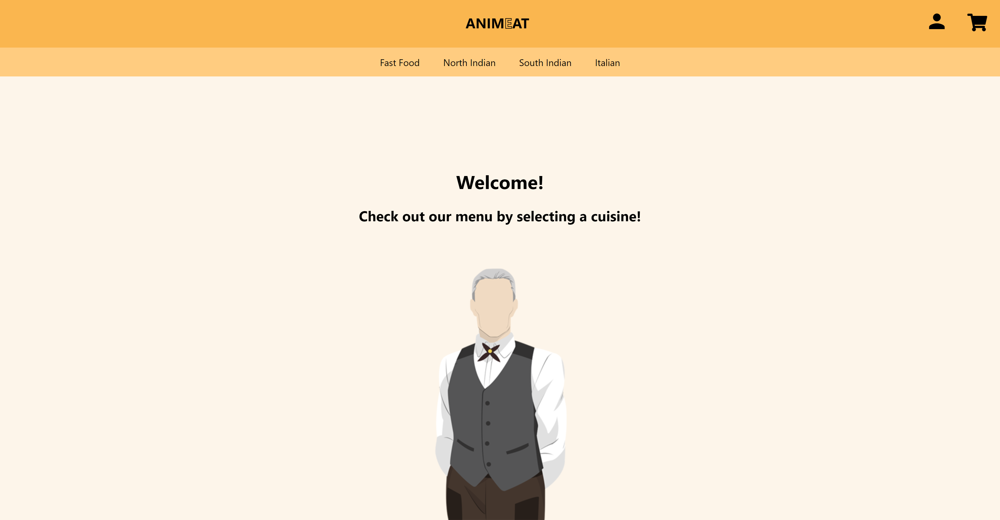
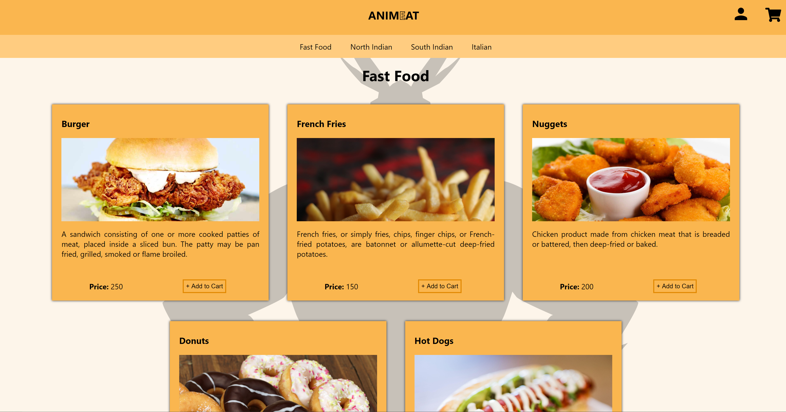
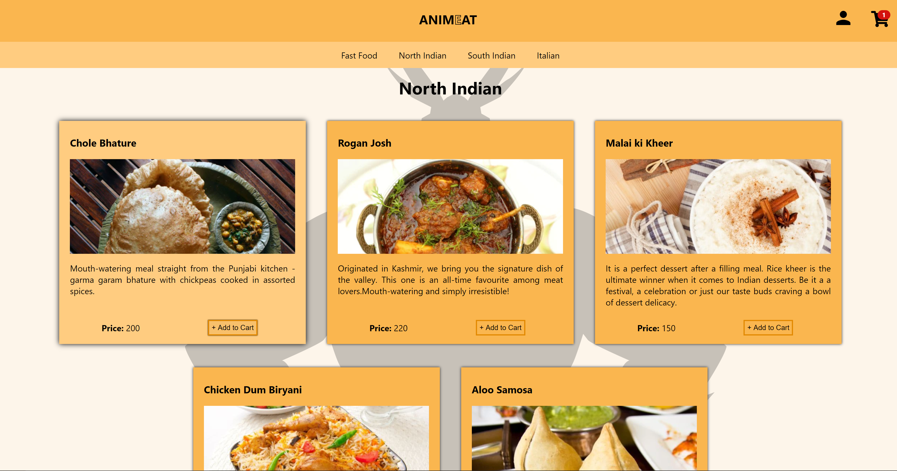
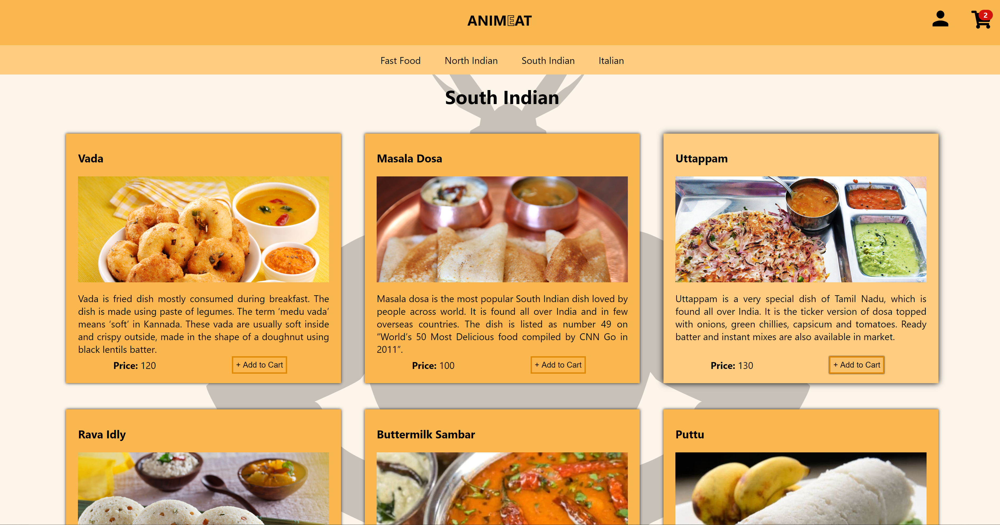
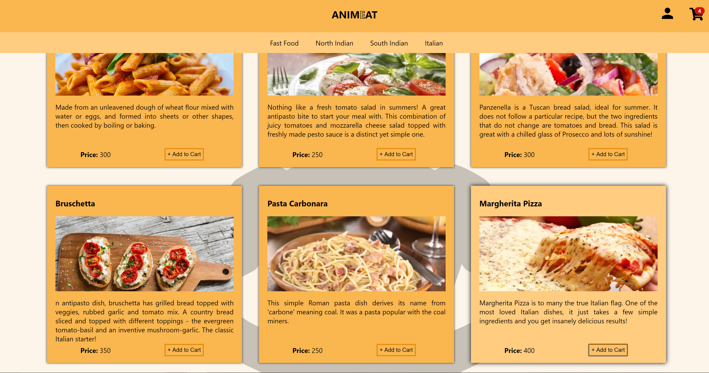
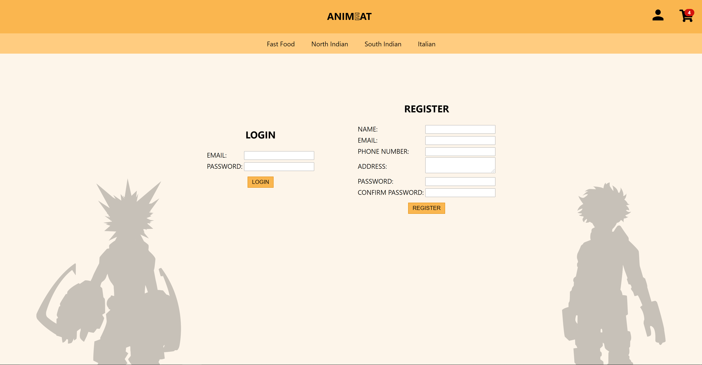
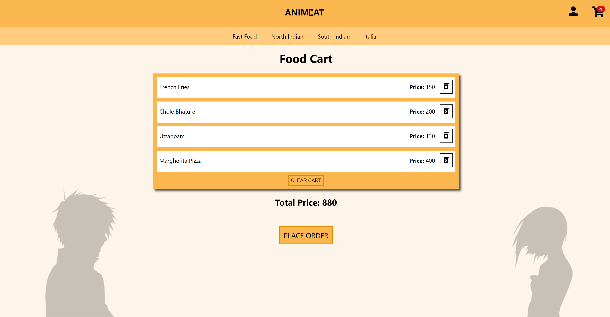
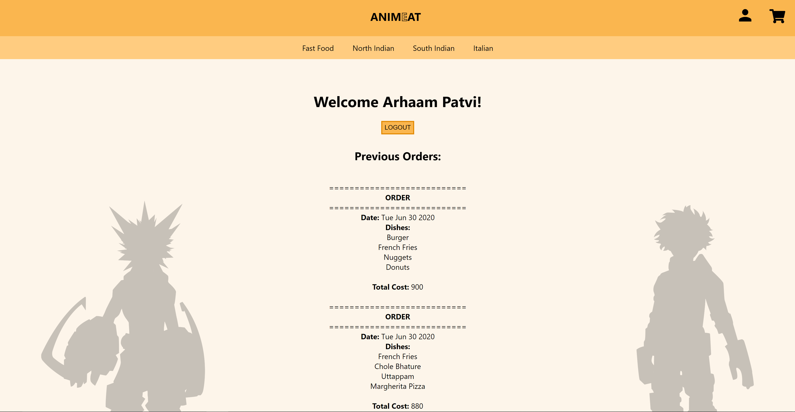

# MERN - Food Ordering Web App
A Web Application for ordering food, built using the MERN Stack.
Following functions are supported:
<ul>
  <li>Login</li>
  <li>Logout</li>
  <li>Register</li>
  <li>View menu based on cuisine</li>
  <li>Add dish to cart</li>
  <li>View cart</li>
  <li>Remove dish from cart</li>
  <li>Clear cart</li>
  <li>Place order</li>
  <li>View order history</li>
</ul>

  &nbsp&nbsp
  &nbsp&nbsp
  &nbsp&nbsp
  

---
<table>
  <tr>
    <td align="center">1)Home</td>
  </tr>
  <tr> 
    <td></td>
  </tr>
  <tr>
    <td align="center">2)Fast Food</td>
  </tr>
  <tr> 
    <td></td>
  </tr>
  <tr>
    <td align="center">3)North Indian</td>
  </tr>
  <tr>
    <td></td>
  </tr>
  <tr>
    <td align="center">4)South Indian</td>
  </tr>
  <tr>
    <td></td>
  </tr>
  <tr>
    <td align="center">5)Italian</td>
  </tr>
  <tr>
    <td></td>
  </tr>
  <tr>
    <td align="center">5)Login/Register</td>
  </tr>
  <tr>
    <td></td>
  </tr>
  <tr>
    <td align="center">6)Profile (With Previous Orders)</td>
  </tr>
  <tr>
    <td></td>
  </tr>
  <tr>
    <td align="center">7)Cart</td>
  </tr>
  <tr>
    <td></td>
  </tr>
  <tr>
    <td align="center">8)Order Placed</td>
  </tr>
  <tr>
    <td></td>
  </tr>
</table>
